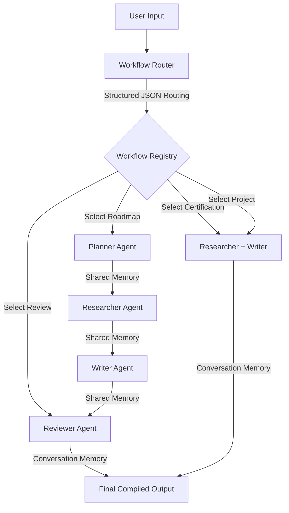

<h1 align="center">AgentCareer 🧭</h1>

<p align="center">
  AgentCareer is a terminal-based AI career coaching platform powered by Gemini. It uses a <strong>Multi-Agent System (MAS)</strong> with dynamic workflow routing and domain knowledge retrieval to analyze career goals and generate personalized, step-by-step roadmaps.
</p>

---

## ✨ Features

- **Dynamic Intent Routing:** Leverages Gemini's structured output capability (`application/json` with schema validation) to classify user requests and route them to custom agent sequences.

- **Sequential Agent Orchestration:** Coordinates specialized agents (Planner, Researcher, Writer, and Reviewer) to build, detail, compile, and polish roadmaps.

- **Dual-State Memory System:**
  - **Shared Memory:** A transient state engine for passing information sequentially between agents within a workflow run.
  - **Conversation Memory:** A session-level message cache that provides history to agents for multi-turn conversations.

- **Domain Knowledge Retrieval (Pre-RAG):** Normalizes user queries to retrieve relevant curriculum guides, target skills, certifications, and project recommendations from local JSON storage.

- **Fault-Tolerant Execution:** Integrates automatic retry blocks (up to 3 attempts) in the orchestrator to recover from transient API errors or execution faults.

- **Interactive Terminal Experience:** Powered by the `rich` library, featuring formatted status monitors, clear workflow step visualization, and structured tables.

---

## ⚙️ Tech Stack

- **Language:** Python 3.12+
- **LLM Integration:** `google-genai` (v2.17.0) SDK
- **Formatting & CLI UI:** `rich` (v15.0.0)
- **Data Validation:** `pydantic` & Dataclasses
- **Environment Configuration:** `python-dotenv`

---

## 🔄 How It Works

The system moves through a structured, multi-step pipeline for every query:



1. **Retrieve Context:** The [`KnowledgeBase`](knowledge/knowledge_base.py) checks the input against [`career_knowledge.json`](data/career_knowledge.json) using normalized substring matching to retrieve relevant blueprints.

2. **Determine Workflow:** The [`WorkflowRouter`](routing/workflow_router.py) requests a structured JSON response matching the [`WorkflowDecision`](models/workflow_decision.py) schema from Gemini to select the target workflow.

3. **Orchestrate Execution:** The [`AgentOrchestrator`](orchestrator/agent_orchestrator.py) fetches the sequence of agents for the selected workflow and executes them sequentially.

4. **Synchronize Context:** During execution, each agent reads past outputs from [`SharedMemory`](memory/shared_memory.py) and appends session context from [`ConversationMemory`](memory/conversation_memory.py).

5. **Compile & Output:** The final agent's payload is formatted and outputted using `rich` terminal highlights, then saved back into [`ConversationMemory`](memory/conversation_memory.py) for the next query turn.

---

## 📂 Project Structure

```text
├── agents/                      # Specialized AI agents representing specific tasks
│   ├── base_agent.py            # Abstract Base Agent defining execute/prompt lifecycle
│   ├── planner_agent.py         # Breaks career goals down into structured phases
│   ├── research_agent.py        # Gathers relevant technologies, trends, and projects
│   ├── writer_agent.py          # Formulates the raw roadmap draft
│   ├── reviewer_agent.py        # Enhances flow, removes duplicates, and polishes text
│   └── certification_agent.py   # [Experimental] Suggests tiered certifications
│
├── prompts/                     # Structured templates for agent guidance
│   ├── planner_prompt.py
│   ├── research_prompt.py
│   ├── writer_prompt.py
│   ├── reviewer_prompt.py
│   └── certification_prompt.py
│
├── routing/                     # Intent classification and workflow management
│   ├── workflow_registry.py     # Registers custom pipelines of agents
│   └── workflow_router.py       # Gemini-driven JSON intent router
│
├── memory/                      # Ephemeral and persistent context storage
│   ├── shared_memory.py         # Inter-agent key-value memory
│   └── conversation_memory.py   # Multi-turn chat message cache
│
├── knowledge/                   # Domain-specific content loaders
│   └── knowledge_base.py        # String-matching query retrieval
│
├── models/                      # Standardized Pydantic & Dataclass schemas
│   ├── agent_response.py        # Standardized wrapper for agent outputs
│   └── workflow_decision.py     # JSON schema for router classifications
│
├── services/                    # API wrappers
│   └── gemini_service.py        # Gemini client initialization and generator
│
├── data/                        # Static JSON domain datasets
│   └── career_knowledge.json    # Preloaded career paths (AI, Data, DevOps)
│
├── .env.example                 # Configuration template
├── requirements.txt             # Project dependencies
├── appv3.py                     # Main interactive CLI application (Active)
├── appv2.py                     # Legacy orchestrator demo file (Archived)
└── app.py                       # Legacy sequential execution demo file (Archived)
```

---

## 🛠 Setup & Local Running

### 1. Prerequisites

- Python 3.12 or newer installed on your system.
- A Gemini API Key from Google AI Studio.

### 2. Installation

Clone the repository and install the dependencies listed in `requirements.txt`:

```bash
pip install -r requirements.txt
```

### 3. Configuration

Create a `.env` file in the root directory:

```bash
cp .env.example .env
```

Open `.env` and fill in your Gemini API details:

```env
GEMINI_API_KEY=your_gemini_api_key_here
MODEL_NAME=gemini-3.5-flash-lite
```

### 4. Running the Application

Launch the interactive CLI session:

```bash
python appv3.py
```

To exit the conversation loop, type `exit`, `bye`, or `quit`.

---

## 🔍 Development Notes

> [!IMPORTANT]
> **Active Entrypoint:** Run `appv3.py` for the complete interactive multi-turn loop. The files `app.py` and `appv2.py` are legacy prototypes retained only for demonstration and structural review.

> [!TIP]
> **Orchestrator Resiliency Testing:** The `ResearchAgent` is coded to fail intentionally on its first two execution attempts by raising a simulated `RuntimeError`. This allows you to verify that the `AgentOrchestrator` successfully handles retries up to its limit (`MAX_RETRIES = 3`) before completing the task.

> [!NOTE]
> **Experimental Components:** `CertificationAgent` is defined in the codebase, but is not currently registered in the active `appv3.py` loop. The `"certification"` workflow in the registry is instead backed by the combination of `researcher` and `writer` agents.

---

## 📄 License

This project is licensed under the MIT License - see the LICENSE file for details.
