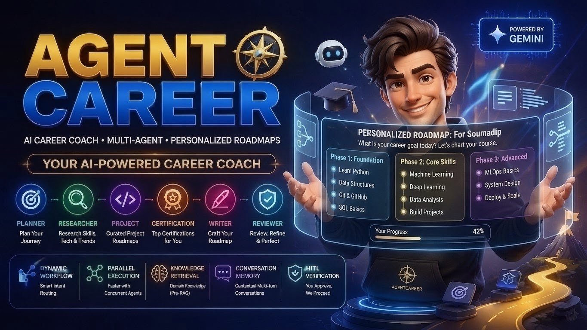
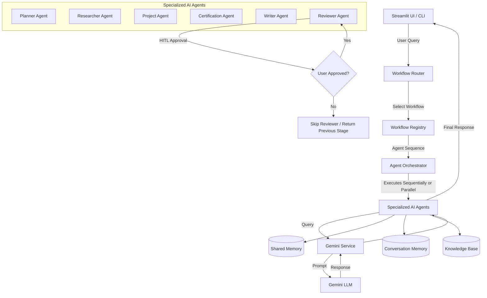

<h1 align="center">AgentCareer 🧭</h1>

<p align="center">
  AgentCareer is a modular, multi-agent AI career coaching platform powered by Gemini.
  It uses specialized agents, dynamic workflow routing, and knowledge retrieval to
  analyze career goals and generate personalized roadmaps through a
  <strong>Terminal CLI</strong> and <strong>Streamlit Web App</strong>.
</p>

<div align="center">
  
</div>

---

## ✨ Features

- **Dynamic Intent Routing:** Leverages Gemini's structured output capability (`application/json` with schema validation via `pydantic`) to classify user requests and route them to custom agent sequences.
- **Hybrid Sequential & Parallel Agent Orchestration:** Coordinates specialized agents. The orchestrator supports sequential execution as well as **parallel agent execution** (running concurrent agent groups using a `ThreadPoolExecutor` to speed up execution).
- **Specialized AI Agents:**
  - **Planner:** Analyzes career goals and breaks the learning journey into logical phases.
  - **Researcher:** Gathers relevant technical skills, recommended technologies, certifications, trends, and project ideas.
  - **Project Agent:** Suggests tiered hands-on projects (beginner, intermediate, advanced) tailored to the career goal.
  - **Certification Agent:** Suggests tiered industry certifications (beginner, intermediate, advanced).
  - **Writer:** Formulates the raw, cohesive draft roadmap from the collected research and planning data.
  - **Reviewer:** Enhances grammar, flow, removes duplicates, and polishes the final layout.
- **Human-in-the-Loop (HITL) Verification:** Interactively requests user approval (`Y/N`) before running critical/polishing stages (specifically the `Reviewer` agent), allowing users to review progress and halt or proceed.
- **Dual-State Memory System:**
  - **Shared Memory:** An ephemeral state engine passed between agents to share sequential outputs and user inputs within a single workflow run.
  - **Conversation Memory:** A session-level message cache that stores past conversation history (User and Assistant messages) to provide contextual memory for multi-turn conversations.
- **Domain Knowledge Retrieval (Pre-RAG):** Normalizes user queries to retrieve matching curriculum guides, target skills, certifications, and project recommendations from local JSON storage (`data/career_knowledge.json`).
- **Resilient, Fault-Tolerant Execution:** Built-in retry mechanism (up to 3 attempts) in the orchestrator with exponential backoff (`2 ** (attempt - 1)` seconds) to recover from transient API or execution errors.
- **Dual User Interfaces:**
  - **Interactive CLI**: Rich CLI console with formatted tables, execution steps, and routing decisions.
  - **Streamlit Web Dashboard**: User-friendly web app showing conversation history, application status, and rendered markdown roadmaps.

---

## ⚙️ Tech Stack

- **Language:** Python 3.12+
- **LLM Integration:** `google-genai` (v2.17.0) SDK
- **Web App Dashboard:** `streamlit`
- **Formatting & CLI UI:** `rich` (v15.0.0)
- **Data Validation & Schemas:** `pydantic` & Dataclasses
- **Environment Configuration:** `python-dotenv`
- **Execution Utilities:** `tenacity` (retry support)

---

## 🔄 How It Works

The system moves through a structured pipeline for every query:



### Registered Workflows

Workflows are registered in `routing/workflow_registry.py` and represent pipelines of sequential and parallel steps:

1. **`roadmap`**: Orchestrates `Planner` -> `Parallel(Researcher, Project, Certification)` -> `Writer` -> `Reviewer`.
2. **`certification`**: Orchestrates `Planner` -> `Parallel(Researcher, Certification)` -> `Writer`.
3. **`project`**: Orchestrates `Planner` -> `Parallel(Researcher, Project)` -> `Writer`.
4. **`review`**: Orchestrates `Reviewer` (Direct polishing/review).

---

## 📂 Project Structure

```text
├── agents/                      # Specialized AI agents representing specific tasks
│   ├── base_agent.py            # Abstract Base Agent defining prompt, conversation, and knowledge lifecycle
│   ├── planner_agent.py         # Breaks career goals down into structured learning phases
│   ├── research_agent.py        # Gathers relevant technologies, trends, and projects
│   ├── project_agent.py         # Suggests tiered projects (Beginner, Intermediate, Advanced)
│   ├── certification_agent.py   # Suggests tiered certifications (Beginner, Intermediate, Advanced)
│   ├── writer_agent.py          # Formulates the raw roadmap draft
│   └── reviewer_agent.py        # Enhances flow, removes duplicates, and polishes text
│
├── prompts/                     # Structured templates for agent guidance
│   ├── planner_prompt.py
│   ├── research_prompt.py
│   ├── project_prompt.py
│   ├── certification_prompt.py
│   ├── writer_prompt.py
│   └── reviewer_prompt.py
│
├── orchestrator/                # Orchestration engine for workflow execution
│   └── agent_orchestrator.py    # Coordinates execution, parallel execution, retries, and HITL approvals
│
├── routing/                     # Intent classification and workflow management
│   ├── workflow_registry.py     # Registers and returns sequential/parallel agent workflows
│   └── workflow_router.py       # Gemini-driven JSON intent router with Pydantic validation
│
├── memory/                      # Ephemeral and persistent context storage
│   ├── shared_memory.py         # Inter-agent key-value memory for sharing state within a run
│   └── conversation_memory.py   # Multi-turn chat message cache for conversation context
│
├── knowledge/                   # Domain-specific content loaders
│   └── knowledge_base.py        # Normalizes queries and retrieves matching entries from data
│
├── models/                      # Standardized Pydantic & Dataclass schemas
│   ├── agent_execution_result.py# Dataclass tracking execution status, attempts, and duration
│   ├── agent_response.py        # Standardized wrapper for agent outputs and metadata
│   └── workflow_decision.py     # JSON schema for router classifications
│
├── services/                    # API wrappers
│   └── gemini_service.py        # Gemini client initialization and content generator
│
├── data/                        # Static JSON domain datasets
│   └── career_knowledge.json    # Preloaded career paths (AI, Data, DevOps)
│
├── .env.example                 # Configuration template
├── requirements.txt             # Project dependencies
├── backend_logic.py             # Shared controller managing workflow setup, routing, and run execution
├── config.py                    # Environment configuration loader and API key validator
├── appv3.py                     # Main interactive CLI application (Active)
├── streamlit_app.py             # Web dashboard interface (Active)
├── appv2.py                     # Legacy orchestrator demo file (Archived)
└── app.py                       # Legacy sequential execution demo file (Archived)
```

---

## 🛠 Setup & Local Running

### 1. Prerequisites

- Python 3.12 or newer installed on your system.
- A Gemini API Key from Google AI Studio.

### 2. Installation

Clone the repository and install the dependencies. (Note: Make sure to install `streamlit` if you plan to use the Web Dashboard):

```bash
pip install -r requirements.txt
pip install streamlit
```

### 3. Configuration

Create a `.env` file in the root directory:

```bash
cp .env.example .env
```

Open `.env` and fill in your Gemini API details:

```env
GEMINI_API_KEY=your_gemini_api_key_here
MODEL_NAME=gemini-2.5-flash-lite
```

### 4. Running the Application

You can run AgentCareer in two ways:

#### A. Interactive CLI Session (Terminal)

Launch the command-line interface:

```bash
python appv3.py
```

- Type your career goal when prompted.
- If the workflow reaches the `Reviewer` step, you will be prompted for **Human Approval**: `Approve? (Y/N):`.
- To exit the conversation loop, type `exit`, `bye`, or `quit`.

#### B. Streamlit Web Dashboard (Browser)

Launch the web application:

```bash
streamlit run streamlit_app.py
```

- A browser tab will open automatically at `http://localhost:8501`.
- Enter your career goal in the text area and click **Generate Career Roadmap**.
- View current run status in the sidebar and read the generated response in the main dashboard.

---

## 🔍 Resiliency & Development Notes

> [!IMPORTANT]
> **Active Entrypoints:** Use `appv3.py` for the complete interactive CLI loop, or `streamlit_app.py` for the web application dashboard. The files `app.py` and `appv2.py` are legacy prototypes retained only for demonstration and structural review.

> [!TIP]
> **Orchestrator Resiliency Testing:** The `ResearchAgent` has code to fail intentionally on its first two execution attempts by raising a simulated `RuntimeError`. This allows you to verify that the `AgentOrchestrator` successfully handles retries up to its limit (`MAX_RETRIES = 3`) before completing the task.
> _Note: This testing logic is currently commented out in `agents/research_agent.py` by default. You can uncomment it to test the retry and backoff behavior._

> [!NOTE]
> **Parallel Execution:** When executing workflows that contain parallel groups (e.g. `["researcher", "project", "certification"]`), the `AgentOrchestrator` runs these agents concurrently using a `ThreadPoolExecutor`. The outputs are saved in `SharedMemory` and gathered sequentially when the `WriterAgent` executes.

---

## 📄 License

This project is licensed under the MIT License. See the [LICENSE](LICENSE) file for details.
